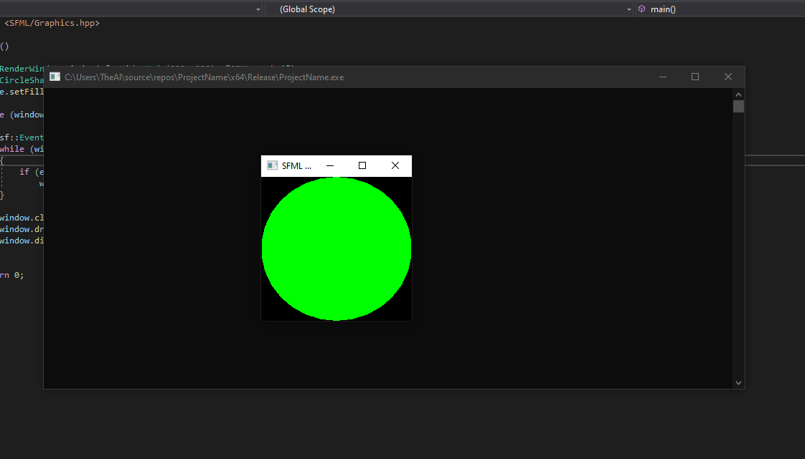

# SFML

## Die Library(s)

SFML ist eine Sammlung Libraries, die für die 2D spiele entwicklung gemacht wurden.
Die wichtigsten Komponenten sind der Wrapper für Fenster management sowie das Grafik rendering. Außerdem stehen Audio und Netzwerk APIs zu verfügung.

## Installation

[Offizielle Anleitung](https://www.sfml-dev.org/tutorials/2.5/start-vc.php)




Grüner Kreis Beispielcode :

```c++
#include <SFML/Graphics.hpp>

int main()
{
    sf::RenderWindow window(sf::VideoMode(200, 200), "SFML works!");
    sf::CircleShape shape(100.f);
    shape.setFillColor(sf::Color::Green);

    while (window.isOpen())
    {
        sf::Event event;
        while (window.pollEvent(event))
        {
            if (event.type == sf::Event::Closed)
                window.close();
        }

        window.clear();
        window.draw(shape);
        window.display();
    }

    return 0;
}
```
