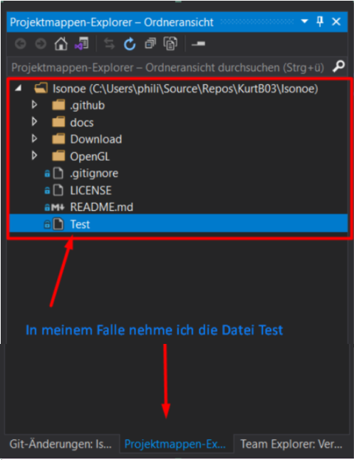

# GitHub

## Git

Commits  

## Account

## Visual Studio integration

### Clone

In Visual Studio über das Git Menü auf Klonen drücken.

In dem Fenster das sich anschließend öffnet auf Github drücken.

In dem Fenster das sich anschließend öffnet drückt man auf Github-Konto, hierdurch öffnet sich eine Internetseite wo man sich mit seinem Github Konto Anmelden muss. Danach schließt man die Internetseite und kommt.

Jetzt wählt man entweder das Gewünschte Repository aus oder gibt die URL des Repository ein und drückt auf Klonen.

Hilfreiche Tools:
Nachdem man sein Projekt über Clone auf seinen Rechner Kopiert hat wäre es Sinnvoll ein Paar Tools in Visual Studio zu öffnen sodass man leichter mit Git Arbeiten kann. Dafür drückt man auf Ansicht, und wählt Projektmappen-Explorer, Git-Änderungen, Team Explorer aus.

Um die Gewünschte Datei in Teams zu öffnen gehen sie auf Projektmappen-Explorer und machen sie Doppelklick auf die Gewünschte Datei.

### Pull

Pull = Updated den Eigenen Code zu der Neusten Version des Ausgewählten Branches 

um die Neuste Version des Repositorys zu bekommen verwenden wir die Funktion Pull diese Versteckt sich hinter diesem Icon in Git-Änderungen

### Commit

Falls sie Jedoch schon etwas in einer Datei eingetragen haben müssen sie dies erst Commiten und anschließend Pushen sodass alle Mitarbeiter ihre Fortschritte für sich benutzen können. Dies Funktioniert über den Commit für alle Button, außerdem ist es Klug eine Kurze Beschreibung seiner Änderungen in dem Textfeld einzugeben welches sich über dem Commit für alle Button finden lässt sodass falls jemand ein Backup laden will genau weiß was zu jedem Push getan wurde.

### Push

Danach muss man die Datei noch Pushen. Dies Geschieht über den Push Button der sich Rechts vom Pull Button Befindet. Solange die Vorgenommenen Änderungen nicht mit den Änderungen eines Anderen Mitglieds nicht Interferieren funktioniert der Push ganz Normal sollten die Änderungen Jedoch mit anderen Änderungen Interferieren muss man den Sogenannten „Merge Conflict“ lösen. Dies wird etwas weiter Unten Genauer erklärt.

Dateien Hochladen:

es gibt mehrere Wege Dateien in Git hochzuladen, entweder tut man dies direkt über Visual Studio oder man fügt die Datei im Browser über Github hinzu.

Browser:
Zuerst öffnet ihr im Browser euer Git Repository / erstellt euch ein Git Repository.

Als Nächstes drückt ihr auf Add file, und wählt Upload files zum Hochladen von Dateien oder Create new file um eine neue Datei zu erstellen.

Zuletzt wählt ihr eure gewünschte Datei noch aus, fügt eine kurze Beschreibung hinzu und drückt auf Commit changes.

Merge Konflikte Lösen:

sollten mehrere Menschen an einer Datei arbeiten wird es unweigerlich zu Merge Konflikten kommen. Diese entstehen wenn jemand der eine Ältere Version der Datei hat als diese auf dem Repository und anschließend versucht diese zu Pushen. Diese Konflikte sind im Normalfall kein Großes Problem da man sie schnell lösen kann solange man weiß wie.

Falls die Fehlermeldung Git: Pushfehler auftreten sollte geht man wie folgt vor. Zuerst drückt man auf den Button Pull und Push.

Danach sollte oben über ihrem geöffneten Fenster in Gelb eine Meldung auf ploppen. in dieser drücken sie auf Merge-Editor öffnen.

Daraufhin sollte sich der Merge Editor öffnen. in diesem können sie alle derzeitigen konflikte sehen die durch den Push entstehen würden. neben den Zeilen wo der Editor Probleme bekommen hat sehen sie kleine Boxen. über diese Boxen können sie Steuern was letzendlich im Repo landet. wenn sie eine Box anhaken wird dieser Teil in ihrem nächsten commit mitgegeben und alles wo keine Kreuze gesetzt sind wird rausgeschmissen. sollten sie bei einem Problem in der Selben Zeile beide Kästchen auswählen werden die Inhalte der Boxen beide Hintereinander mit dem Nächsten Push in ihr Repo geschoben.

nachdem sie alle Konflikte behoben haben müssen sie noch auf Merge akzeptieren drücken um ihre Ergebnisse so festzulegen.

nun müssen sie nur noch commiten und pushen, dies geht in diesem fall über den Button Gestagter Commit der an der Selben stelle zu finden ist wo sonst der Commit Button ist.

und zu Guter letzt müssen sie nur noch Pushen sodass die Dateien auf dem Repo landen.

