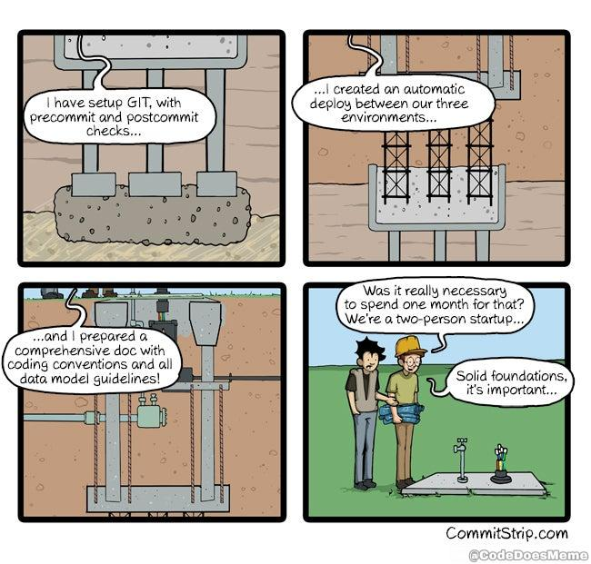

# Hello World

### [Scrum](scrum.md)

_______________

### [GitHub](github.md)

### [Markdown](markdown.md)

### [Bash](bash.md)

### [Makefile](makefile.md)

### [CD/CI](pipeline.md)

### [OpenGL](OpenGL/opengl.md)

### [Taschenrechner](taschenrechner.md)

### [Und Jetzt ?!](fazit.md)

### [FAQ](faq.md)

_______________

#### [XKCD](https://xkcd.com/)
